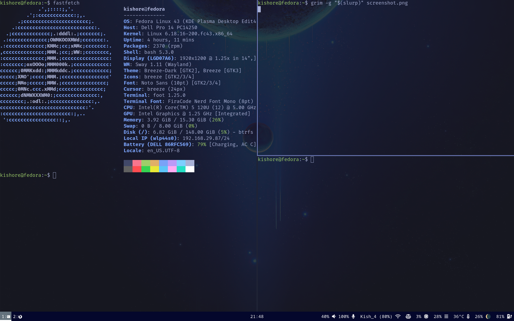

# Sway Tokyo Night Dotfiles

A minimal **Sway rice** based on the Tokyo Night color palette.

## 🖼 Screenshot



## ⚙ Components

* Window Manager: Sway
* Bar: Waybar
* Launcher: Rofi
* Terminal: foot
* Icon Theme: Papirus
* Theme: Tokyo Night inspired

## 📦 Requirements

Install these packages:

* sway
* waybar
* rofi
* foot
* papirus-icon-theme
* grim

On Fedora:

```
sudo dnf install sway waybar rofi foot papirus-icon-theme grim
```

## 📁 Installation

Clone the repo:

```
git clone https://github.com/Kishore-Student/Sway_TokyoNight_Theme_dotfiles.git
```

Copy the configs:

```
cp -r .config/* ~/.config/
```

Restart Sway:

```
Mod + Shift + C
```

## 🎨 Features

* Tokyo Night inspired color palette
* Bottom Waybar layout
* Clean Rofi launcher theme
* Workspace icons
* Minimal window borders and gaps


## 📜 License

This project is released under the MIT License.

